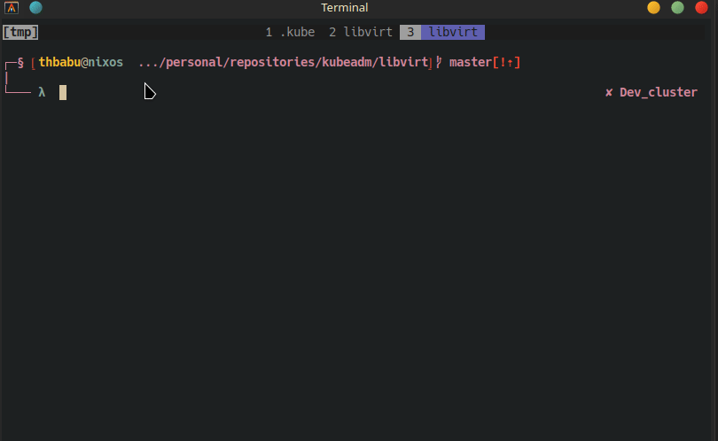

# Kubectl Context Switcher Script

This script automates the process of switching between Kubernetes contexts using a hotkey combination in the Zsh shell. It requires the following prerequisites:

## Prerequisites

- **Zsh Shell**: The script is designed to run in a Zsh shell environment. Ensure that Zsh is installed on your system.

- **fzf**: Fuzzy finder tool used for interactive selection. Install fzf using your system's package manager or follow the installation instructions on the [fzf GitHub repository](https://github.com/junegunn/fzf).

- **kubectl**: Command-line tool for interacting with Kubernetes clusters. Install kubectl according to the instructions provided in the official Kubernetes documentation: [Install and Set Up kubectl](https://kubernetes.io/docs/tasks/tools/install-kubectl/).

## Usage

1. **Installation**: Execute the provided script in a Zsh shell environment. This will install a script file `kcon.sh` in the `~/.config/script` directory and add a line to the `~/.zshrc` file to source the script.

2. **Functionality**: After installation, pressing `Ctrl+K` in the Zsh shell will trigger the `kcon` function, allowing you to select a Kubernetes context interactively using `fzf` and switch to the chosen context using `kubectl config use-context`.

## Script Details

The script performs the following actions:

- **Directory Setup**: Ensures that the `~/.config/script` directory exists, creating it if necessary.

- **Script File Creation**: Creates a script file named `kcon.sh` in the `~/.config/script` directory. This script contains the `kcon` function definition and binds it to the `Ctrl+K` hotkey using the `bindkey` command.

- **File Permissions**: Sets the executable permission for the `kcon.sh` script.

- **Zsh Configuration**: Appends a line to the `~/.zshrc` file to automatically source the `kcon.sh` script when starting a Zsh shell session.

